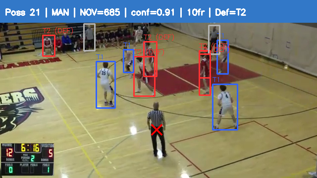

# AI Basketball Scout

A computer vision pipeline that analyzes basketball game film to automatically identify defensive schemes. Takes raw game video as input and produces a scouting report classifying the defense as man-to-man or zone.

## How It Works

```
Game Video → Player Detection → Team Classification → Defensive Analysis → Scouting Report
```

**1. Player Detection** — YOLOv8 detects players in each frame, sampling every 10th frame for efficiency.

**2. Jersey Color Extraction** — Crops the torso region of each detection and extracts jersey color in HSV space, filtering out skin tones, court floor, and referee stripes.

**3. Team Classification** — K-Means clustering (k=2) groups players by jersey hue. Referees are identified by high brightness variance (striped jerseys) and filtered out. Off-court players (bench/coaches) are removed using IQR-based spatial filtering.

**4. Defensive Scheme Analysis** — For each frame, computes spatial metrics between the two teams:
- **Nearest-opponent distance** — how closely defenders track offensive players
- **Nearest-opponent variance (NOV)** — consistency of defensive tracking
- **Hull area ratio** — defensive spread relative to offensive spread

A Gaussian Mixture Model determines whether the team runs one or two defensive schemes by comparing BIC scores of 1-component vs 2-component fits. If unimodal, the scheme is inferred from spatial metrics (tight defender proximity = man-to-man, loose = zone).

**5. Report Generation** — Outputs an HTML scouting report with the identified scheme, confidence scores, per-possession breakdown, timeline visualization, and annotated sample frames.

## Sample Output

The pipeline generates a scouting report like this:

```
Identified Defensive Scheme: Man-to-Man
Possessions Analyzed: 28
Avg Defender Distance: 60px
Coverage Ratio: 0.49
```

Annotated validation frames show team assignments (blue = Team 1, red = Team 2) with filtered detections marked:



## Pipeline Architecture

```
detect_players.py          # YOLO detection → bounding boxes
        ↓
reextract_colors.py        # Jersey color extraction (torso crop, HSV)
        ↓
classify_teams.py           # K-Means team classification + ref/bench filtering
        ↓
analyze_defense.py          # Spatial metrics → GMM → man/zone classification
        ↓
validate_defense.py         # Annotated validation frames
        ↓
run_pipeline.py             # Orchestrator + HTML report generation
```

## Setup

```bash
# Clone
git clone https://github.com/TylerBindseil3/ai-basketball-scout.git
cd ai-basketball-scout

# Install dependencies
python -m venv .venv
.venv\Scripts\activate      # Windows
pip install -r requirements.txt

# Place your game video
mkdir -p data/videos
# Copy your video as data/videos/game_trimmed.mp4
```

## Usage

```bash
# Full pipeline (detection + analysis + report)
python run_pipeline.py

# Skip YOLO detection (reuse existing detections)
python run_pipeline.py --skip-detection

# Regenerate report only
python run_pipeline.py --report-only
```

Output is saved to `data/processed/report/report.html`.

## Technical Details

| Component | Technique | Why |
|-----------|-----------|-----|
| Detection | YOLOv8s | Good accuracy/speed tradeoff at 640x360 |
| Color space | HSV | Separates color identity from lighting conditions |
| Team clustering | K-Means (k=2) | Two teams = two clusters; simple and effective |
| Ref detection | Brightness std dev | Striped jerseys have high luminance variance |
| Off-court filter | IQR on Y-position | Robust outlier detection for bench players |
| Scheme classification | GMM + BIC | Avoids forced binary split; detects unimodal data |
| Dead ball detection | Multi-signal (hull CV, centroid movement, x-spread) | No single metric catches all dead ball types |

## Known Limitations

- **Team imbalance** — At 640x360 resolution, darker jerseys are under-detected (~3.0 vs 5.6 players/frame), reducing analyzable frames to ~12%
- **Defensive team inference** — Uses hull area (smaller = defense) which can flip frame-to-frame; majority vote smoothing would help
- **Single game tested** — Thresholds are tuned for one game; would need calibration for different venues/cameras

## Dependencies

- Python 3.10+
- ultralytics (YOLOv8)
- opencv-python
- pandas, numpy, scipy
- scikit-learn
- matplotlib
